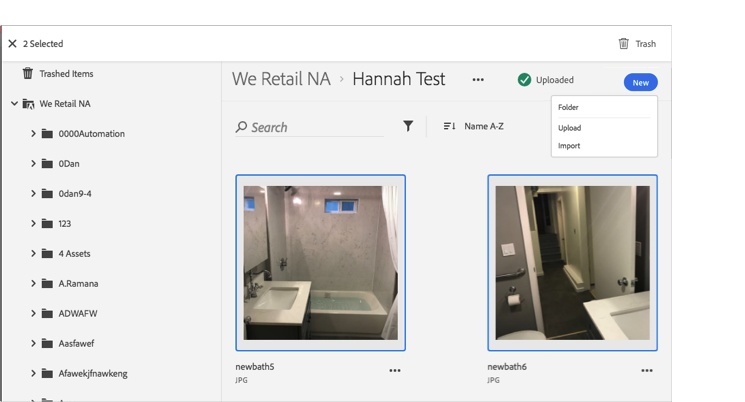

# Eliminare una risorsa{#trash-an-asset}

Puoi eliminare una risorsa nella libreria di Adobe Experience Cloud per rimuoverla dalla libreria.

Per eliminare una risorsa nella libreria Experience Cloud:

1. Fai clic su una o più risorse da eliminare. 

1. Fai clic sull’icona **[!UICONTROL Elimina]** nella parte superiore della pagina.

