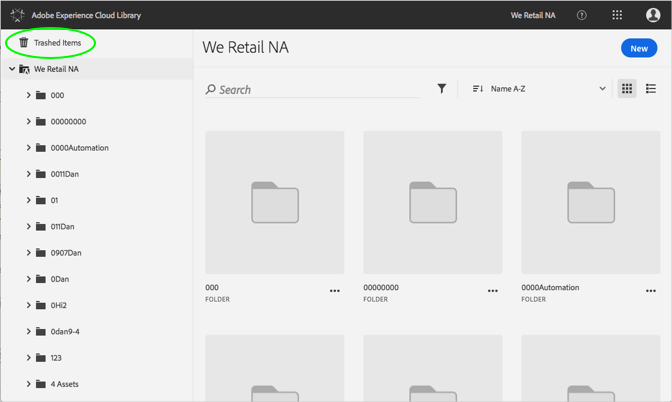
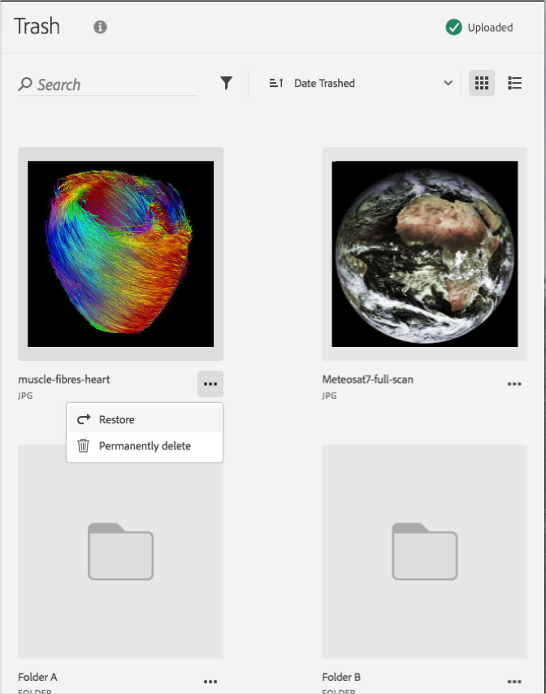

# Eliminare definitivamente una risorsa eliminata{#permanently-delete-a-trashed-asset}

Puoi eliminare definitivamente una risorsa eliminata nella libreria di Adobe Experience Cloud.

Quando un elemento viene eliminato, viene visualizzato nell’area Elementi eliminati della libreria Experience Cloud per 60 giorni. Se non ripristini gli elementi, la libreria Experience Cloud li elimina definitivamente dopo 60 giorni.

Puoi eliminare definitivamente una risorsa eliminata entro i 60 giorni precedenti:

1. Fai clic su **[!UICONTROL Elementi eliminati]**.

   

1. Fai clic su uno o più elementi da eliminare definitivamente.
1. Fai clic su **[!UICONTROL Ulteriori informazioni > Elimina definitivamente]**.

   

1. Conferma l’eliminazione definitiva delle risorse selezionate.

