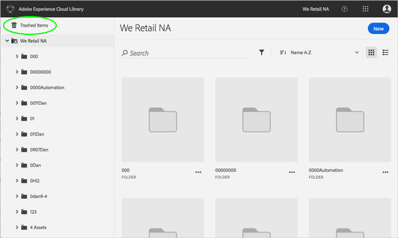

# Ripristino di una risorsa con caratteristiche{#restore-a-trashed-asset}

Puoi ripristinare una risorsa che hai scaricato nella libreria di Adobe Experience Cloud.

Quando un elemento viene cestino, viene visualizzato nell'area Elementi temporizzati della libreria Experience Cloud per 60 giorni. Se non ripristini gli elementi, la libreria Experience Cloud li elimina definitivamente dopo 60 giorni.

Ripristina una risorsa scaricata prima di 60 giorni:

1. Fate clic **[!UICONTROL su Elementi con ritaglio]**.

   

1. Fate clic su uno o più elementi da ripristinare.
1. Fate clic su **[!UICONTROL Ulteriori informazioni &gt; Ripristina]**.

   

1. Confermate di voler ripristinare le risorse selezionate.

La conferma della risorsa ripristinata viene visualizzata nella parte superiore.
