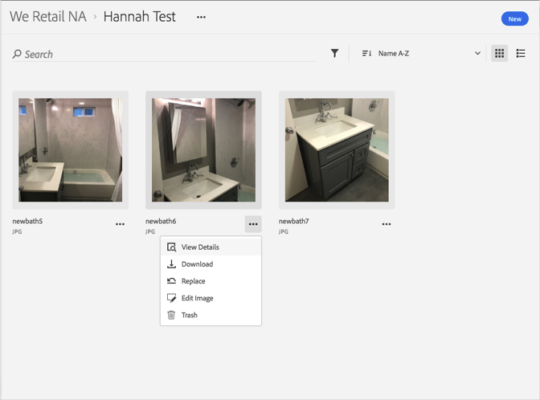
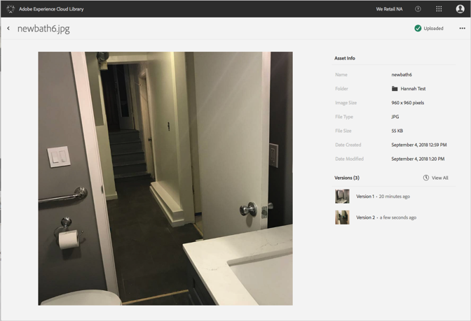

# Ripristino di una versione precedente di una risorsa{#revert-to-an-older-version-of-an-asset}

Puoi ripristinare una versione precedente di una risorsa nella libreria di Adobe Experience Cloud.

Per ripristinare una versione precedente di una risorsa nella libreria Experience Cloud:

1. Fai clic su una risorsa.
1. Fai clic sul menu **[!UICONTROL Altre opzioni]** (puntini) accanto alla risorsa.

   

1. Fai clic su **[!UICONTROL Dettagli risorsa]**.
1. Fai clic su **[!UICONTROL Visualizza tutto]** accanto a Versioni per visualizzare tutte le versioni della risorsa.

   

1. Nell’elenco delle versioni, fai clic sul menu **[!UICONTROL Altre opzioni]** (puntini) accanto alla versione da ripristinare.

   

1. Fai clic su **[!UICONTROL Ripristina]**.

La versione che hai ripristinato ora diventa quella corrente.
