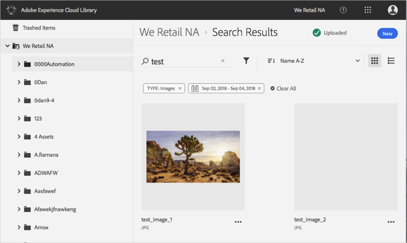

# Cercare risorse{#search-for-assets}

Cerca risorse nella libreria di Adobe Experience Cloud per trovare risorse nell'organizzazione o in una cartella specifica.

Cerca le risorse nella libreria Experience Cloud utilizzando la barra di ricerca. La ricerca cerca i nomi dei file.

