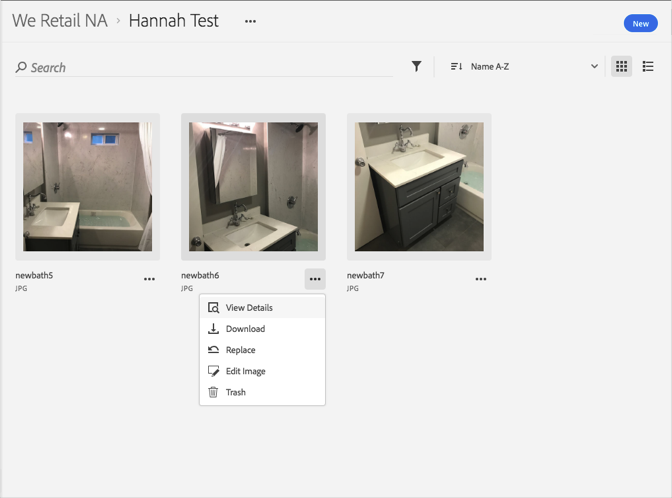

# Visualizzare le versioni precedenti di una risorsa{#view-previous-versions-of-an-asset}

Puoi visualizzare le versioni precedenti di una risorsa nella libreria di Adobe Experience Cloud.

Per visualizzare le versioni precedenti di una risorsa nella libreria Experience Cloud:

1. Selezionate una risorsa.
1. Fate clic sul **[!UICONTROL menu Altre opzioni]** (puntini di sospensione) accanto alla risorsa.

   

1. Selezionate **[!UICONTROL Dettagli risorsa]**.
1. Selezionate **[!UICONTROL Visualizza tutto]** accanto a Versioni per visualizzare tutte le versioni della risorsa.

   

