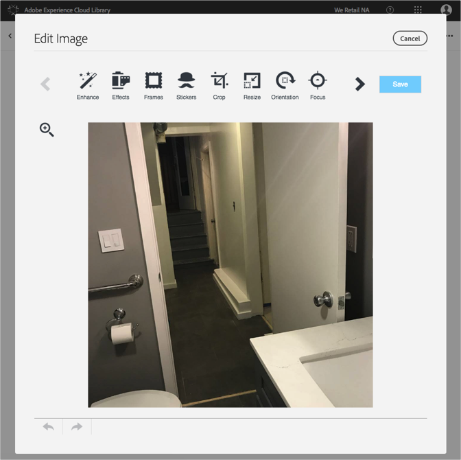

# Modificare un’immagine{#edit-an-image}

Utilizza l’editor di immagini integrato nella libreria di Adobe Experience Cloud per modificare un’immagine direttamente dalla libreria.

Per modificare un’immagine dalla libreria Experience Cloud:

1. Fai clic su un’immagine da modificare.
1. Fai clic su Modifica immagine. Quando la salvi, l’immagine viene salvata come nuova versione.

   L’editor di immagini si apre e puoi modificare l’immagine.

   

