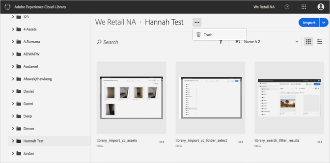
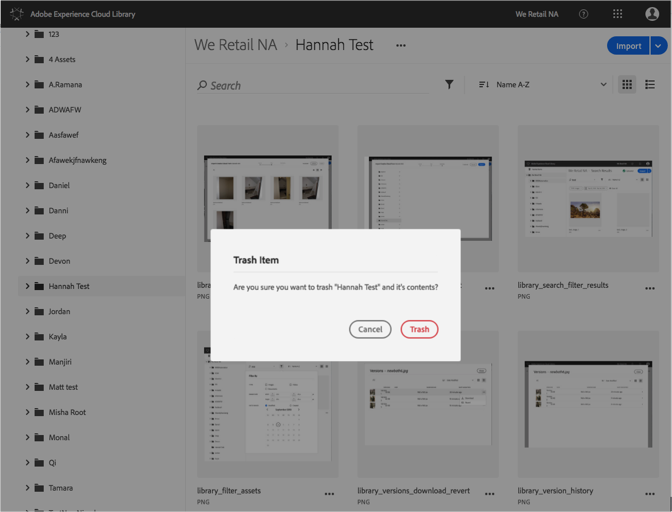

# Eliminare una cartella{#trash-a-folder}

Puoi eliminare una cartella nella libreria di Adobe Experience Cloud.

Per eliminare una cartella nella libreria Experience Cloud:

1. Fai clic sulla cartella da eliminare.
1. Fai clic sul menu **[!UICONTROL Altre opzioni]** (puntini) e seleziona **[!UICONTROL Elimina]**.

   

1. Conferma l’eliminazione della cartella.

   

