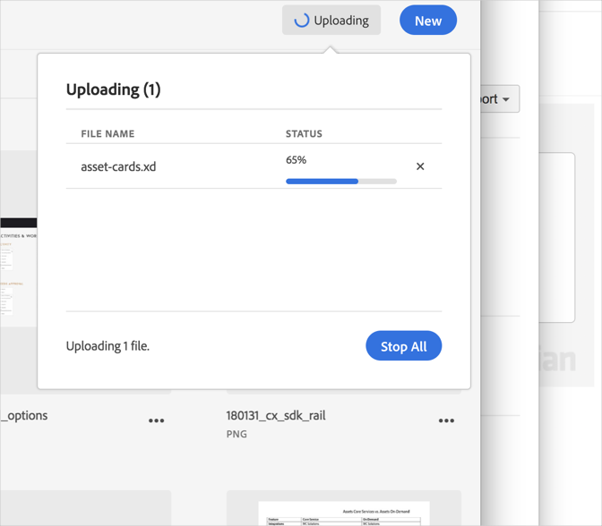

# Annullare un caricamento{#cancel-an-upload}

Annulla un caricamento dal dispositivo alla libreria di Adobe Experience Cloud se hai selezionato un file errato o troppo grande.

Per annullare un caricamento già avviato:

1. Fai clic sull’indicatore delle notifiche.
1. Fai clic su **[!UICONTROL Interrompi tutto]** per interrompere tutti i download o fai clic sulla **[!UICONTROL X]** accanto ai singoli file da annullare.

   

Se selezioni uno o più file con lo stesso nome, la libreria di Experience Cloud richiede di sostituire le versioni precedenti o di mantenere quelle nuove.
