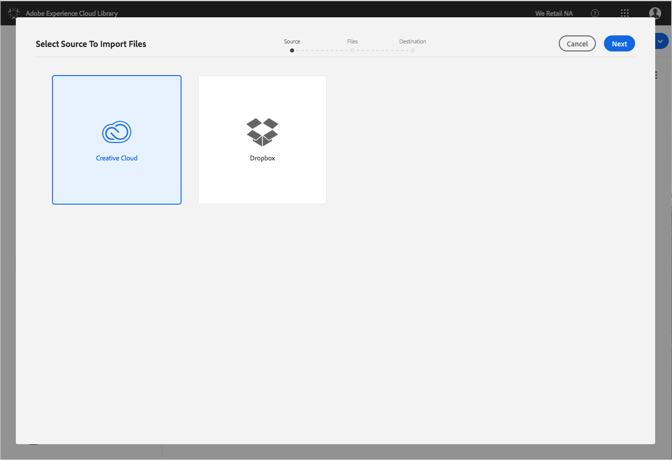
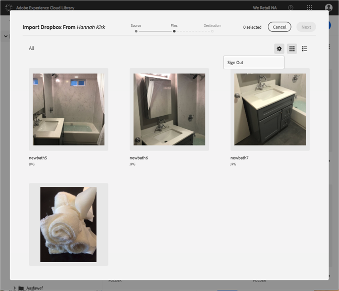

# Modificare gli account Dropbox o Creative Cloud{#change-dropbox-or-creative-cloud-accounts}

Passa a un account Dropbox o Creative Cloud diverso per aggiungere contenuto alla libreria di Adobe Experience Cloud.

Dopo aver effettuato l’accesso a un account Dropbox o Creative Cloud, continuerai a effettuare l’accesso a meno che tu non disconnetti o cambi account.

Per passare a un account Dropbox o Creative Cloud diverso:

1. Seleziona **[!UICONTROL Nuovo]** &gt; **[!UICONTROL Importa]**.

   

1. Seleziona **[!UICONTROL Creative Cloud]** o **[!UICONTROL Dropbox]**.

   

1. Seleziona **[!UICONTROL Avanti]**.
1. Seleziona l’icona a forma di ingranaggio nell’angolo superiore destro.

   

1. Seleziona **[!UICONTROL Disconnetti]**.
1. Accedi all’altro account.

