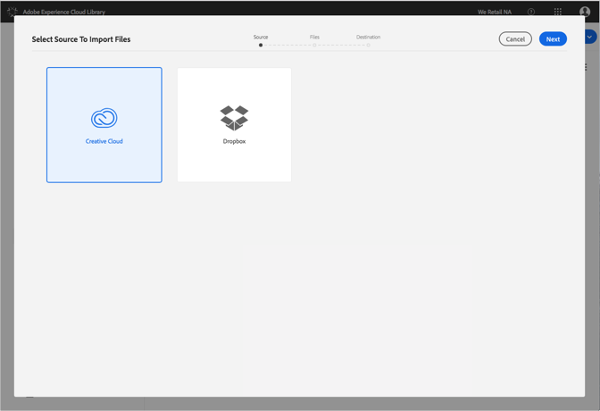

# Importare file Creative Cloud nella libreria di Adobe Experience Cloud{#import-creative-cloud-files-into-the-adobe-experience-cloud-library}

Importare file da Creative Cloud nella libreria di Adobe Experience Cloud per gestirli da qualsiasi prodotto Adobe Experience Cloud.

>[!NOTE]
>
>È necessario creare una cartella prima di eseguire questa attività.

Per importare file Creative Cloud nella libreria Experience Cloud:

1. Seleziona **[!UICONTROL Nuovo]** &gt; **[!UICONTROL Importa]**.

   

1. Seleziona **[!UICONTROL Creative Cloud]**.

   Effettua l’accesso al tuo account Creative Cloud, se non lo hai già fatto.

   

1. Fai clic su **[!UICONTROL Avanti]**.
1. Seleziona uno o più file da importare.

   

1. Fai clic su **[!UICONTROL Avanti]**.
1. Seleziona la cartella in cui inserire le risorse.

   >[!NOTE]
   >
   >Puoi scegliere una cartella in cui importare le risorse. Per inserire file in cartelle diverse, ripeti questa attività per ciascuna cartella.

   

1. Fai clic su **[!UICONTROL Importa]**.

