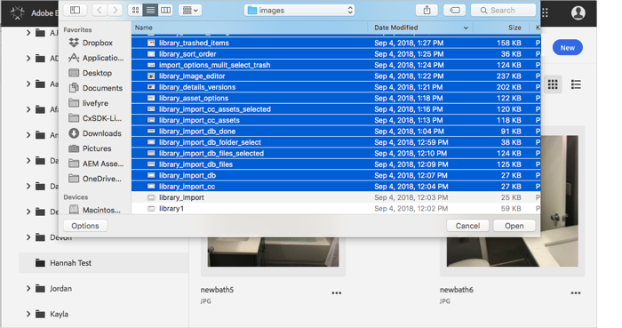
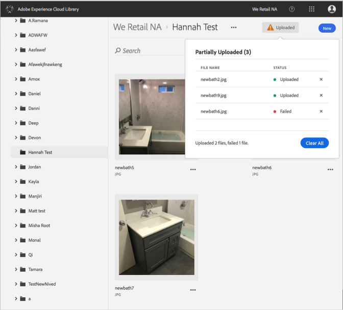

# Caricare risorse dal dispositivo{#upload-asset-from-device}

Carica le risorse dal dispositivo per gestirle nella libreria di Adobe Experience Cloud.

Per caricare le risorse dal dispositivo nella libreria Experience Cloud:

1. Seleziona **[!UICONTROL Nuovo]** > **[!UICONTROL Carica]**.

   

1. Seleziona le risorse da caricare nella libreria Experience Cloud.

   

1. Quando i file sono stati caricati, nella casella di notifica vengono visualizzati un messaggio di conferma o un messaggio di errore.

   

